# Tugas 1 IF3110 Pengembangan Aplikasi Berbasis Web

## Deskripsi Aplikasi Web

Aplikasi web in merupakan aplikasi untuk keperluaan bisnis Willy Wangky yaitu penjualan coklat agar dapat dilakukan dengan cara daring. Saat memakai aplikasi ini pengguna dapat melakukan pendaftaran akun, login, logout, pencarian produk, mendapatkan penjelasan produk secara detail, pembelian produk dan dapat melihat riwayat pembelian produk. Willy Wangky sebagai seorang superuser dapat menambahkan jenis coklat baru yang ingin dijual serta menambah ketersediaan coklat menggunakan aplikasi ini juga. User interface yang digunakan mengikuti desain low fidelity dari Jan, kenalan dari Willy yang berpengalaman dengan distribusi makanan dan minuman ringan.

## Daftar Requirement

Minimum Requirement:
1. Terinstall Apache
2. Terinstall MySQL
3. Terinstall web browser terbaru seperti Chrome dan Firefox

## Cara Instalasi 

### Install Apache dan MySQL
Untuk menginstall Apache dan MySQL dapat langsung menggunakan aplikasi XAMPP. Panduan instalasi sebagai berikut:
* Windows : dapat menggikuti cara instalasi di https://www.geeksforgeeks.org/how-to-install-xampp-on-windows
* Linux : 
    1. Buka terminal
    2. Jalankan `chmod 755 xampp-linux-*-installer.run`
    3. Jalnkan `sudo ./xampp-linux-*-installer.run`
    4. XAMPP berhasil terinstall
* Mac OSX : dapat mengikuti cara instalasi di https://www.webucator.com/how-to/how-install-start-test-xampp-on-mac-osx.cfm

### Install Web Browser
Cara instalasi yang diberikan hanya untuk Chrome dan Firefox. Silahkan telusuri sendiri untuk web browser lainnya
* Chrome : dapat mengikuti cara instalasi di https://support.google.com/chrome/answer/95346?co=GENIE.Platform%3DDesktop&hl=en
* Firefox :
    - Windows : dapat mengikuti cara instalasi di https://support.mozilla.org/en-US/kb/how-download-and-install-firefox-windows
    - Linux : dapat mengikuti cara instalasi di https://support.mozilla.org/en-US/kb/install-firefox-linux
    - Mac OSX : dapat mengikuti cara instalasi di https://support.mozilla.org/en-US/kb/how-download-and-install-firefox-mac

## Cara Menjalankan Server

1. Copy seluruh 1 folder web aplication ini ke `../xampp/htdocs` (biasanya folder xampp ada di direktori `C:/` )
2. Buka XAMPP
3. Ubah Port MySQL ke 3306
4. Start Apache dan MySQL
5. Buka url `localhost/phpmyadmin` di browser
6. Buat database baru dengan nama `choco_factory`
7. Import database yang berada di folder database ke database yang telah dibuat
8. Masukkan url `localhost/tugas-besar-1-2020` di browser dan akan diredirect ke halaman login
9. Aplikasi siap digunakan

## Screenshot Tampilan Aplikasi

### Halaman Login dan Register

#### Login Biasa
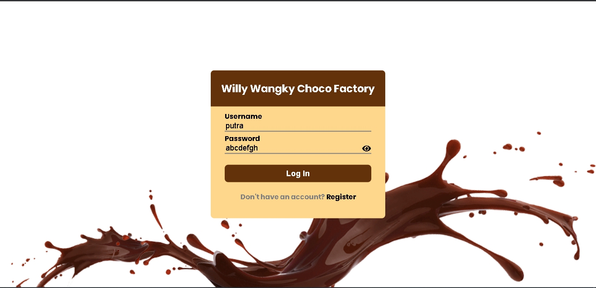

#### Register dengan username telah terpakai
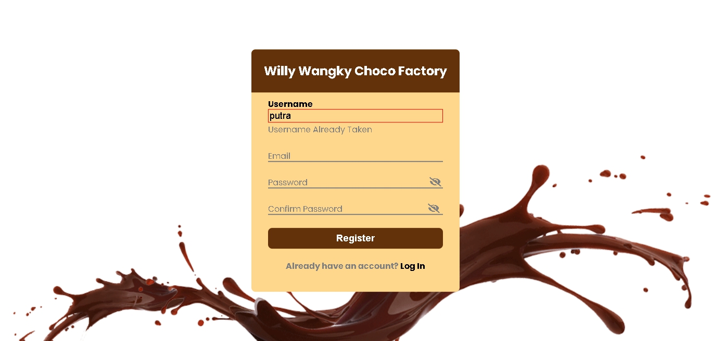

#### Register dengan email telah terpakai
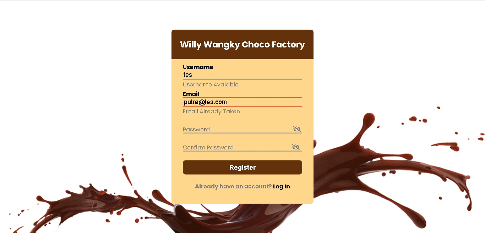

#### Alert saat mencoba register dengan username/email yang telah terpakai
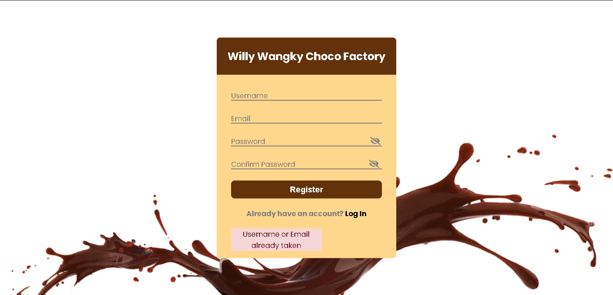

### Halaman Dashboard

#### Dashboard setelah login dengan user putra
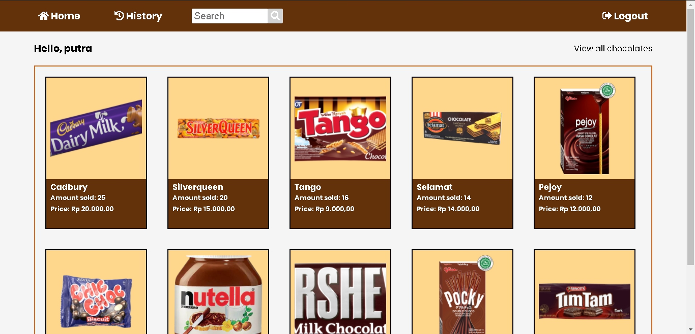

#### Dashboard dengan tampilan 10 coklat dengan penjualan terbanyak
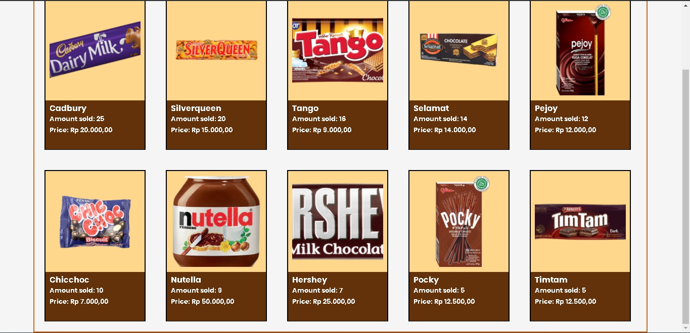

#### Dashboard dengan tampilan seluruh coklat yang tersedia
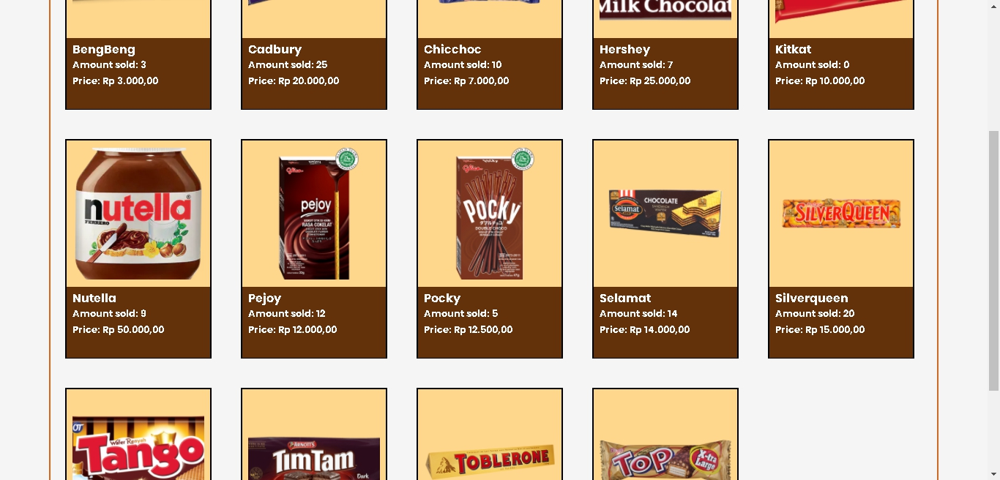

### Halaman Search

#### Search dengan query huruf "C"
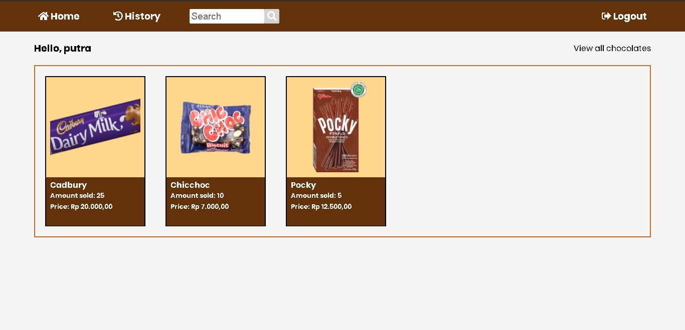

#### Search saat tidak ditemukan hasil
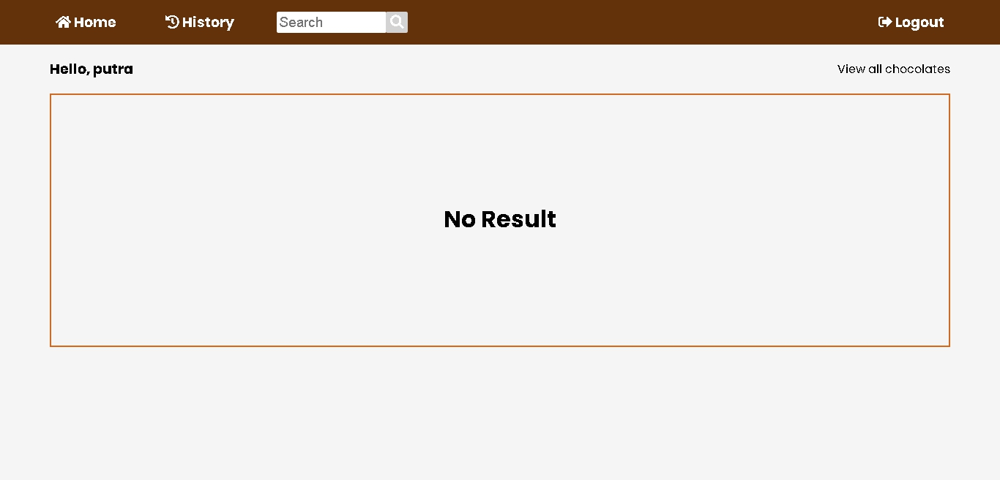

### Halaman Transaction History, Detail, Do Detail, dan Contoh Pembelian

#### Halaman transaction history sebelum transaksi
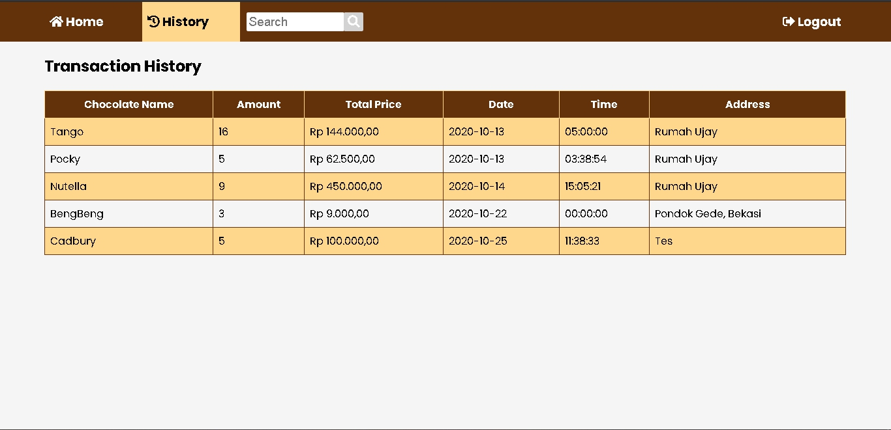

#### Halaman Detail Coklat Silverqueen
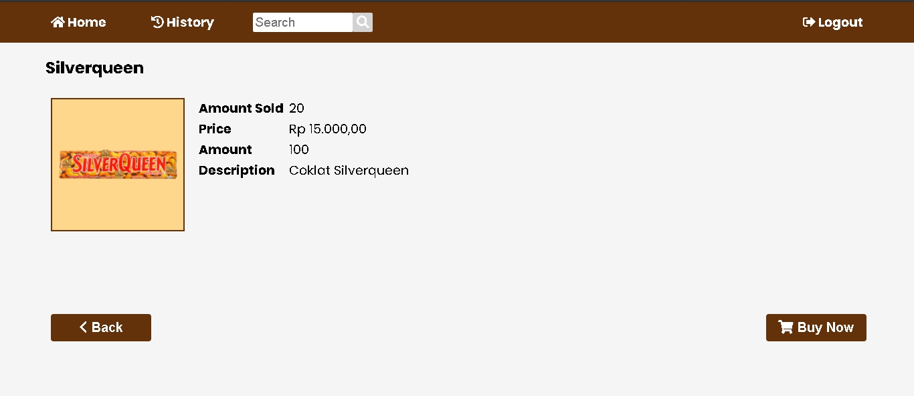

#### Halaman Do Detail Coklat Silverqueen
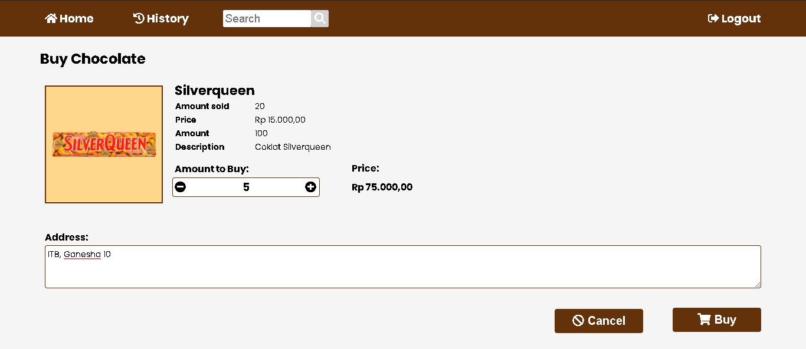

#### Halaman Transaction History setelah pembelian
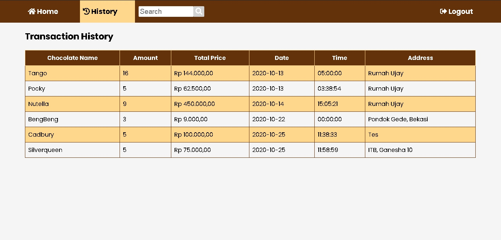

#### Halaman Do Detail saat stok coklat tidak cukup untuk dibeli
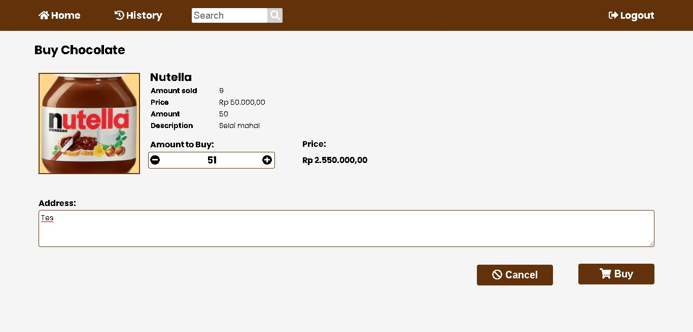

### Halaman Add Chocolate

#### Alert saat Image yang digunakan sama

#### Menambahkan produk chacha

#### Saat coklat berhasil ditambahkan

## Pembagian Tugas

Pembagian tugas kelompok kami sebagai berikut:

### Frontend
1. Login : 13516080, 13518095
2. Register : 13516080, 13518095
3. Dashboard: 13518095
4. Search : 13518095
5. Transaction History: 13518095 
6. Detail : 13518095
7. Do Detail : 13518095
8. Add Chocolate : 13518095

### Backend
1. Login : 13518077
2. Register : 13518077
3. Dashboard: 13516080, 13518095
4. Search : 13518095
5. Transaction History: 13516080, 13518095 
6. Detail : 13518077
7. Do Detail : 13518095
8. Add Chocolate : 13518077

### Database
Choco_factory.db: 13516080

## About
Pembuatan aplikasi ini bertujuan untuk pemenuhan Tugas Besar 1 IF3110 WBD Teknik Informatika semester 5 tahun 2020.
Author :
1. Putra Hardi Ramadhan - 13516077
2. Filbert Wijaya - 13518077
3. Syarifuddin Fakhri Al Husaini - 13518095